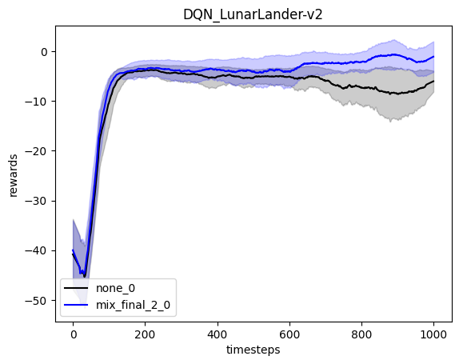

#  In this project, we evaluate feature extraction in the RL filed

<table style="width:100%; table-layout:fixed;">
  <tr>
<td></td>

<td></td>
<tr>
</table>


```python
import os
from utils_lib.utils import Utils
import time
import torch
import torch.nn as nn
import random
import numpy as np
import matplotlib.pyplot as plt
import utils_lib.feature_extractor_layers as FeatureExtractorLayer
from utils_lib.all_feature import all_feature_extract as All_Features

from itertools import cycle
cycol = cycle('bgrcmk')
from scipy.signal import savgol_filter

utils = Utils()

size_ttt = 100

[...]
    
```

    Warning: Gym version v0.24.1 has a number of critical issues with `gym.make` such that environment observation and action spaces are incorrectly evaluated, raising incorrect errors and warning . It is recommend to downgrading to v0.23.1 or upgrading to v0.25.1


# Feature extraction by activation function

We will project our input into activation function, and evaluate the gains for our RL agent


```python
layer = FeatureExtractorLayer.NoneLayer
layer = layer(size_ttt,4,"cpu",True)
test_layer(layer)
```

    torch.Size([1, 100, 1])


    /tmp/ipykernel_140213/793892438.py:23: UserWarning: Creating a tensor from a list of numpy.ndarrays is extremely slow. Please consider converting the list to a single numpy.ndarray with numpy.array() before converting to a tensor. (Triggered internally at ../torch/csrc/utils/tensor_new.cpp:230.)
      time_t= torch.tensor([time_t]).type(torch.float64)


    

    


# Result of the feature extraction


```python
plt.figure(0)
env = 16
policy = 2
plt.title(utils.all_policies[policy]["name"]+"_"+utils.all_envs[env]["env"])
plt.xlabel("timesteps")
plt.ylabel("rewards")
plot_by_array([policy],[env],[0],[0],[11011,11012,11013,11014,11015])

```


    

    


# Finaly, we can evaluate almost everything in terms of Feature Extraction


```python


feature_extraction = 168

layer = All_Features[feature_extraction]["feature_layer"]
layer = layer(size_ttt,4,"cpu",True)
test_layer(layer)

plt.figure(0)
env = 16
policy = 2
plt.title(utils.all_policies[policy]["name"]+"_"+utils.all_envs[env]["env"])
plt.xlabel("timesteps")
plt.ylabel("rewards")
plot_by_array([policy],[env],[0],[0],[11011,11012,11013,11014,11015])
plot_by_array([policy],[env],[feature_extraction],[0],[11011,11012,11013,11014,11015])

```

    torch.Size([1, 100, 9])


    

    


    

    


# To show the result, we can plot environements and policies on the same grid


```python
fig = grid_plot_base(
    envs=utils.all_envs_robotics,
    policies=utils.all_policies_robotics,
    fek=[0,168],fev=[0])
```


    

    

